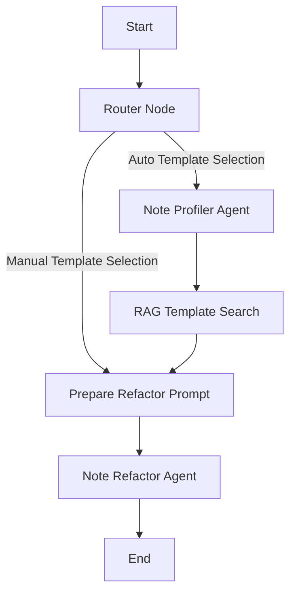

# 📝 Mark-me-down

Transform messy, unformatted, or raw notes into clean, well-structured, and readable Markdown documents. 

> [!NOTE]
> This repository is a **Kaggle AI Agents: Intensive Vibe Coding Capstone Project**. While a full-fledged agentic workflow might seem like overkill for a single-purpose note-refactoring application, the project is designed as an architectural sandbox to apply advanced agentic concepts, workflow orchestration, automated developer loops, and safety guardrails.

---

## 🎯 Purpose & Philosophy

Mark-me-down operates on a single-purpose, stateless, human-in-the-loop philosophy. Unlike chat applications, it is designed for a single direct transformation:
1. **Input**: Paste raw, messy notes.
2. **Configure**: Select options (API provider, refactoring mode, output style, and templates).
3. **Execute**: Clean the note.
4. **Refine**: Edit the resulting markdown inline and copy or download the file.

The application enforces **no state**, **no session history**, **no chat logs**, and **no autonomous loop iterations** during runtime.

---

## 🛠 Tech Stack & Architecture

- **Frontend**: Streamlit
- **Agent Framework**: Google Agent Development Kit (ADK) V2 Workflow Engine
- **LLM Services**: Gemini API (`gemini-3.1-flash-lite`, etc.) & OpenAI API (`gpt-4o-mini`, etc.) via LiteLLM
- **Database**: Supabase (used for dynamic storage and retrieval of note templates)
- **Validation**: Pydantic (strongly typed request/response validation at boundaries)

### ADK Agentic Workflow

When a note is processed, the system coordinates execution through a directed ADK workflow:



1. **Router Node**: Directs the request path based on manual or automatic template selection.
2. **Note Profiler Agent**: Analyzes the note characteristics (e.g. topic, tone, structural indicators).
3. **RAG Template Search**: Generates embedding for the profile and queries Supabase to retrieve the most semantically relevant markdown template.
4. **Prepare Refactor Prompt**: Builds context-specific instructions dynamically combining rewrite modes, output styles, and template instructions.
5. **Note Refactor Agent**: Executes the core rewriting step following structural instructions and outputs clean markdown.

---

## 🛡 Security, Guardrails & BYOK

Mark-me-down prioritizes user privacy and application safety through a robust defense-in-depth layout:

### Bring Your Own Key (BYOK)
- **Zero-Persistence Authentication**: API keys (Gemini / OpenAI) are provided by the user directly in the UI.
- Keys are kept exclusively within the ephemeral Streamlit session state and are never written to disk or sent to a third-party server.

### Safety Guardrails
To prevent abuse and formatting failures, the app uses two guardrail phases:

> [!IMPORTANT]
> **Pre-Workflow Guardrails**
> - **Input Length Check**: Inputs are capped at **5,000 characters** to prevent resource exhaustion.
> - **Lightweight Prompt Injection Detection**: Before feeding user input to downstream LLM agents (which enforce strict Pydantic output schemas), a lightweight check runs on `gemini-3.1-flash-lite` (or `gpt-4o-mini` via LiteLLM). If an injection attempt is detected, the run is blocked immediately. This avoids Pydantic serialization errors when receiving safety block text.

> [!TIP]
> **Post-Workflow Guardrails**
> - **HTML Restriction**: Filters out unexpected HTML elements, allowing only safe inline Markdown tags.
> - **System Prompt Leakage Protection**: Blocks responses containing parts of the system's operational instructions.
> - **Policy Blocklist Filtering**: Screens output against policy violation terms (e.g., hate speech, malware, etc.).

---

## 🤖 Agentic Development Resources

This repository goes beyond traditional software development by embedding agent-assistive resources directly within the codebase:

### Development Skills (`.agents/skills`)
> [!NOTE]
> Contrary to standard best practices where IDE-level agent capabilities and skills are kept local or gitignored, the development skills in `.agents/skills` have been committed to Git. This demonstrates how coding agents (such as Google Antigravity) are instructed to perform code creation, styling, and testing.

- **`developing-with-streamlit`**: Guides agents in streamlit styling, fragments, and cache optimization.
- **`google-agents-cli-*`**: Instruction sets for agent scaffolding, observability, evaluation, and deployment.
- **`create-readme`**: Guides the generation of clean, premium repository documentation.
- **`stride-analysis-patterns`**: Integrates STRIDE threat modeling principles into coding agent security assessments.

### Automated Git Hook (Semgrep + Antigravity)
The repository contains an automated pre-commit pipeline that links linting with agentic code generation:
1. **Semgrep Verification**: A pre-commit hook (`scripts/git_pre_commit.py`) intercepts commits to scan Python files for structural changes (e.g. new functions or classes).
2. **Antigravity Delegation**: If structural changes are detected, the hook aborts the commit and launches the **Antigravity CLI** in the background.
3. **Auto-Maintenance**: The background Antigravity agent:
   - Analyzes the staged diff.
   - Automatically updates developer documentation in `docs/`.
   - Modifies or generates relevant unit tests in `tests/`.
   - Runs `pytest` to verify the codebase.
4. **Auto-Commit**: If tests pass, it stages the updates and commits the work automatically.

---

## 🚀 Getting Started

### Prerequisites
- Python 3.10 or higher
- API Key for Gemini and/or OpenAI
- Supabase account (or connection secrets if using predefined templates)

### Installation
1. Clone the repository:
   ```bash
   git clone <repository-url>
   cd mark-me-down
   ```

2. Create a virtual environment and install dependencies:
   ```bash
   python -m venv .venv
   source .venv/bin/activate  # On Windows: .venv\Scripts\activate
   pip install -r requirements.txt
   ```


4. Run the Streamlit application:
   ```bash
   streamlit run app.py
   ```
